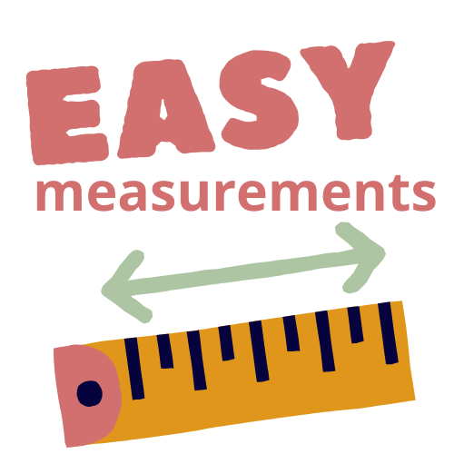

<p align="center">
  
</p>

# Easy Measurements

**Easy Measurements** is a simple and intuitive desktop application that allows users to load an image, define a reference scale, and perform precise measurements of areas (polygons) directly on the image.

Ideal for professionals and students in architecture, biology, microscopy, and any field where image-based measurements are needed.

## 🔧 Features

* 📷 Load any image (PNG, JPEG, etc.)
* 📏 Set a reference scale (e.g., 1 cm = X pixels)
* 🗌 Draw and measure polygonal shapes
* 💾 Save annotated images with measurements
* 📄 Export data to CSV
* 🔍 Zoom and pan controls
* �� Undo/redo
* 👟 Mouse cursor adapts to mode (pan, draw, scale)
* 🧹 Grid overlay and point labels toggle
* 🆐️ Built-in help popup

## 🖼️ Screenshots

(Include screenshots of the app in use here)

## 📥 Installation

### Run from source

1. Clone this repository:

   ```bash
   git clone https://github.com/AnaRitaCarreira/easy-measurements.git
   cd easy-measurements
   ```

2. Create a virtual environment and install dependencies:

   ```bash
   pip install -r requirements.txt
   ```

3. Run the app:

   ```bash
   python app.py
   ```

## 🛠 Build Executable (Windows)

To create a standalone `.exe` using PyInstaller:

```bash
pyinstaller --noconsole --onefile --add-data "assets/logo.png;assets" app.py
```

> Note: Make sure the `assets/logo.png` file exists and is included.

## 📁 Folder Structure

```
easy-measurements/
├── app.py
├── assets/
│   └── logo.png
├── README.md
├── requirements.txt
└── ...
```

## ✅ Dependencies

* Python 3.8+
* `tkinter`
* `Pillow`
* `opencv-python`
* `numpy`

Install all with:

```bash
pip install -r requirements.txt
```

## 📄 License

MIT License. See `LICENSE` file for details.

---

Made with ❤️ for easy visual measurements.
